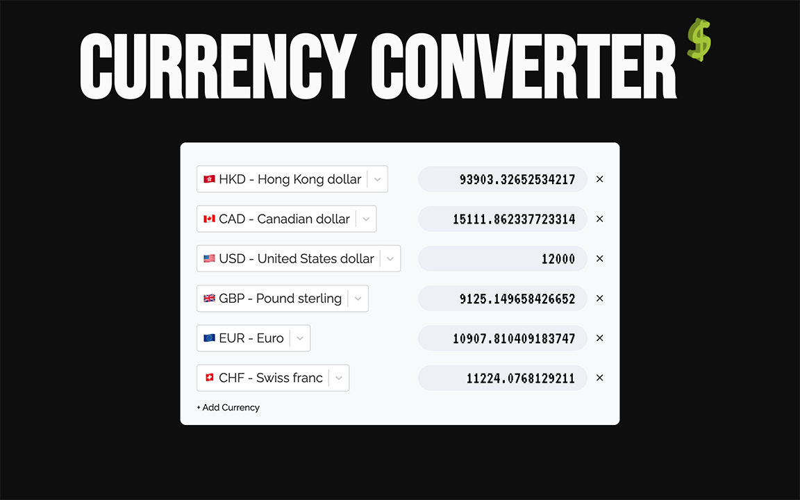

# Currency Converter

A currency converter that displayed multiple currencies on one page. Each currency has a seperated number input. When user enter a new value into an input, it would be converted to all other currencies.

## Table of Content

- [Live Demo](#live-demo)
- [Final Product](#final-product)
- [Dependencies](#dependencies)
- [Getting Started](#getting-started)
- [File Structure](#file-structure)
- [Credits](#credits)

## Live Demo

The web app is deployed to [Netlify](https://www.netlify.com):  
https://that-currency-converter.netlify.app/

## Final Product

  
User can:

- Enter a new value into any input, it will be converted to all other currencies
- Update currency by searching/selecting on the dropdown menu, the corresponding value will be updated according to the exchange rate
- Add currency (max: 10) by click "Add Currency"
- Remove currency (min: 2) by clicking on the cross at the end of the currency

## Dependencies

- [React](reactjs.org/)
- [React Select](https://react-select.com/home)
- [axios](https://axios-http.com/)

## Getting Started

1. Clone or download this repository onto your local device.
2. `cd` to the folder where this project is cloned.
3. Install all dependencies with `npm install` command.
4. Run the app in the development mode with `npm start` command.
5. Open the broswer and visit: [http://localhost:3000/](http://localhost:3000/).

## File Structure

<pre>
📦currency-converter
 ┣ 📂docs
 ┣ 📂public
 ┣ 📂src
 ┃ ┣ 📂Components
 ┃ ┃ ┣ 📂CurrencyList
 ┃ ┃ ┃ ┣ 📂Control
 ┃ ┃ ┃ ┃ ┣ 📜AddCurrencyButton.jsx
 ┃ ┃ ┃ ┃ ┣ 📜ErrorMessage.jsx
 ┃ ┃ ┃ ┃ ┗ 📜index.jsx
 ┃ ┃ ┃ ┣ 📂CurrencyListItem
 ┃ ┃ ┃ ┃ ┣ 📜AvailableCurrencyList.jsx
 ┃ ┃ ┃ ┃ ┣ 📜DeleteCurrencyButton.jsx
 ┃ ┃ ┃ ┃ ┗ 📜index.jsx
 ┃ ┃ ┃ ┣ 📜Currency.css
 ┃ ┃ ┃ ┣ 📜ValueInput.jsx
 ┃ ┃ ┃ ┗ 📜index.jsx
 ┃ ┃ ┗ 📂Title
 ┃ ┃ ┃ ┣ 📜Title.css
 ┃ ┃ ┃ ┗ 📜index.jsx
 ┃ ┣ 📂hooks
 ┃ ┃ ┗ 📜useData.js
 ┃ ┣ 📜App.css
 ┃ ┣ 📜App.js
 ┃ ┣ 📜App.test.js
 ┃ ┣ 📜constants.js
 ┃ ┣ 📜helper.js
 ┃ ┣ 📜index.js
 ┃ ┣ 📜reportWebVitals.js
 ┃ ┗ 📜setupTests.js
 ┣ 📜.gitignore
 ┣ 📜LICENSE
 ┣ 📜README.md
 ┣ 📜package-lock.json
 ┗ 📜package.json
</pre>

### 📂 docs

Store image that is displayed in this `README.md` document.

### 📂public

Contains `index.html` (react components are rendered on this file)and the favicon `favicon.png` (which is also an image in the web app) for the web app.

### 📂 src

#### 📂 Components

Contains react components.

#### 📂 hooks

Contains custom hook `useData`.

#### 📜 `App.css`

The style sheet for `App.js`

#### 📜 `App.js`

The top level component.

#### 📜 `constants.js`

Contain constants that are used by other files.

#### 📜 `helper.js`

Contain helper functions for other files.

#### 📜 `index.js`

This file renders react components onto `index.html`.

### 📜 `.gitignore`

This file is to ignore certain files so they are not pushed to github.

### 📜 `README.md`

This document that you are reading.

### 📜 `package.json`

This file contains:

- the list of dependencies (node libraries that the executable code (and development code) needs)
- scripts: Define the in-project shortcut commands

## Credits

- [Currency API](https://github.com/fawazahmed0/currency-api) by [Fawaz Ahmed (@fawazahmed0)](https://github.com/fawazahmed0)
- [Currencies list with emojis](https://gist.github.com/avaleriani/2ce5d24f905825ce0e2f8489c9fda4c3) by [Agu Valeriani (@avaleriani)](https://gist.github.com/avaleriani)
- The design is a mix of [Julia Dolgova](https://www.behance.net/gallery/139329605/Daily-UI-Challenge-004-Calculato-surrency-converter) and [Anton Mastakov & Evgeny UPROCK](https://www.behance.net/gallery/139120523/Broadway-Malyan-Web-concept)'s deisgn
- [Favicon](https://www.flaticon.com/free-icons/dollar-symbol) created by [Freepik](https://www.flaticon.com/authors/freepik) - [Flaticon](https://www.flaticon.com/)
